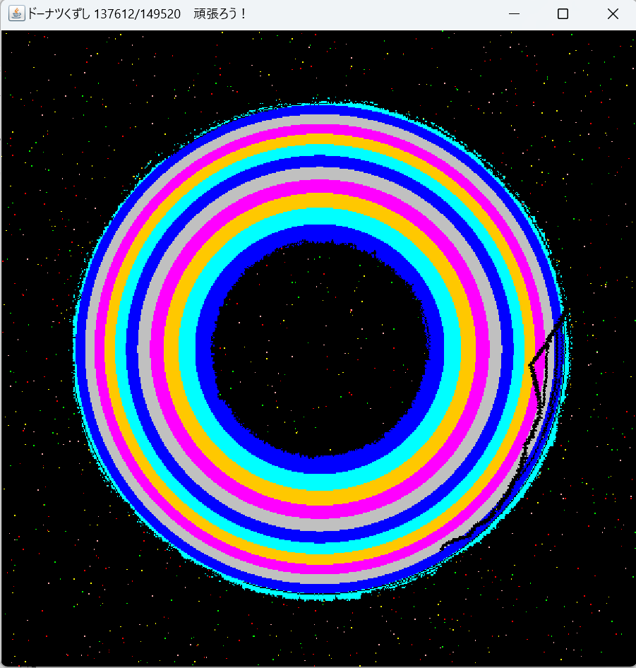
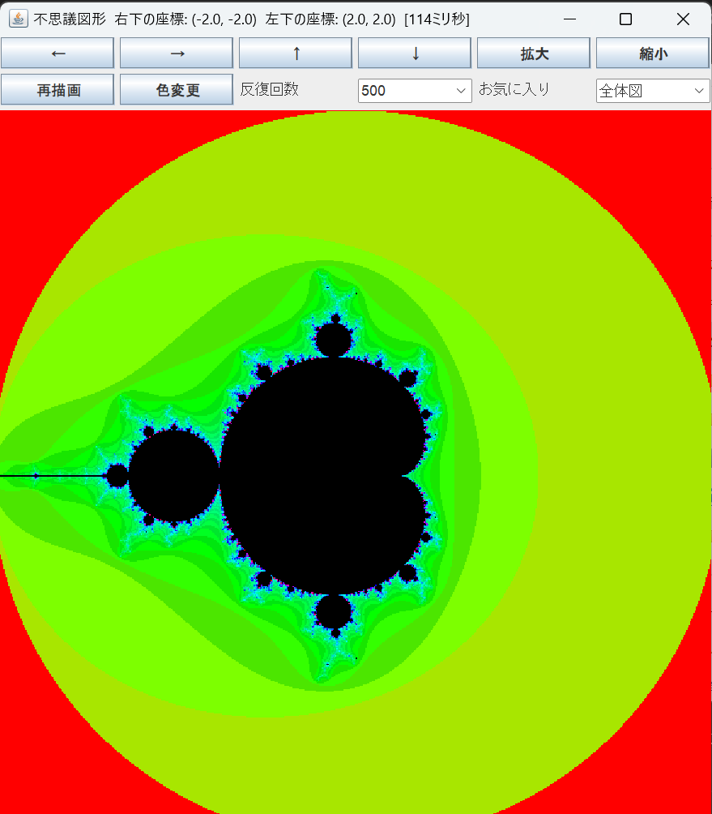

# ウェブプログラミング(Java)

Javaで作成したアプリケーションのコードを載せています。 

## ドーナツくずし
ボールがドーナツに当たったら、当たった場所が消えるドーナツくずしのアプリケーションを作成しています。
<table align=center>
  <tr>
    <td>
      
    </td>
  </tr>
</table>

## 不思議図形
フラクタル図形を表示するアプリケーションを作成しています。
<table align=center>
  <tr>
    <td>
      
    </td>
  </tr>
</table>

## 素因数分解
入力した自然数を素因数分解するコードを作成しています。

## 自然数の和
1から、入力した自然数の値までのすべての自然数の和を計算するコードを作成しています。

(最終更新 2025/5/31)
